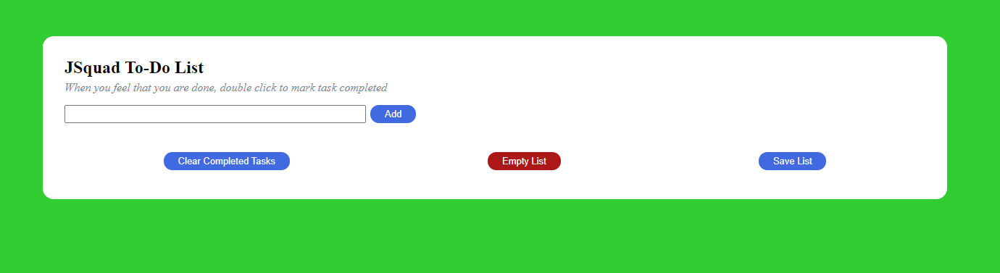
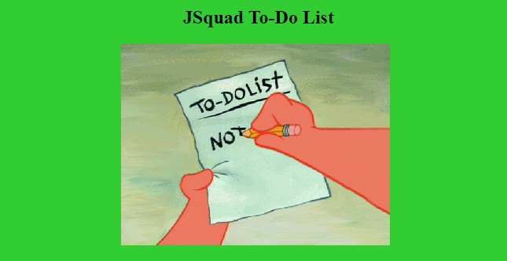

# To Do List

The To Do List  enables the user to create a todo list.

## Technologies Used 

* HTML
* CSS 
* Javascript 

## Table of Contents 

1. [Description](#Description)
2. [Installation](#Installation)
3. [Usage](#Usage)
4. [Testing](#Testing)
5. [Screenshots](#Screenshots)

## Description 

This To-Do list app is designed to track a users To-Do items. A user may create the to-do list item by typing what it is in the fieldbox that needs to be taken care of and a list item will append on the todo list. 

## Installation 

* Clone the repository to your local device 
* Install the necessary npm packages by typing the following command in the terminal:

```


## Screenshots



